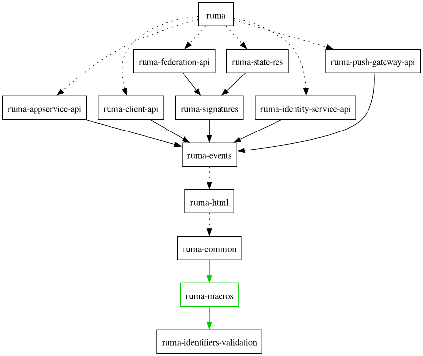

# How to release new versions of the Ruma crates

## Pre-requisites

You need to have valid tokens to create the releases and publish the crates:

* a non-expired GitHub access token with the proper permissions set up in
  `/xtask/config.toml`.
* a non-expired [crates.io token](https://crates.io/settings/tokens) with the
  `publish-update` scope and that it is enrolled with `cargo login`
 

Releasing one of the crates is very simple since it is entirely automated.
The only thing you have to do is to run

```
cargo xtask release {crate} {version}
```

The `xtask` script will then take care of

* updating all affected `Cargo.toml`s
* adding a new version header to the changelog
* collecting the changes from the changelog
* creating a release commit
* publishing the new release to [crates.io](https://crates.io/)
* creating a release tag and GitHub release if applicable

If some part of `cargo xtask release` fails, for example because of internet
connectivity issues, you can run the exact same command again to retry. Steps
that were already completed will be detected and an option to continue with
the next step will be given.

## Dependencies

Dependencies obviously need to be released before dependents. Also, a breaking
change release in a dependency should usually be followed by a new release of
all dependents.



<small><code>cargo depgraph --all-features --dedup-transitive-deps --workspace-only --build-deps --exclude xtask | dot -Tpng > contrib/workspace_deps.png</code></small>

## Other repositories

Crates in other repositories in the ruma organization depend on the ruma crate
and should be updated and possibly released at least after a breaking release:

- [ruma-client](https://github.com/ruma/ruma-client)
- [ruma-examples](https://github.com/ruma/ruma-examples)
- [synapse-admin-api](https://github.com/ruma/synapse-admin-api)
